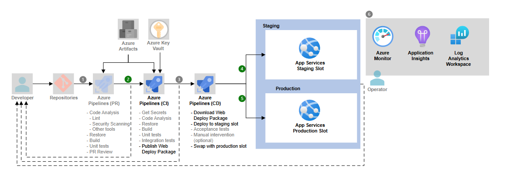

🚀 End-to-End CI/CD on Azure with GitHub, Azure DevOps & Azure App Service

I recently worked on an Azure cloud architecture that automates deployments and provides full observability across environments.

### Application use case: .NET EAD (Distance Learning) IT exam platform

This project underpins an online EAD (Distance Learning) IT examination platform built on ASP.NET (.NET 8) and hosted on Azure App Service. The solution is optimized for reliable, scalable assessments with strong observability and DevOps foundations.

🔹 Source Control: GitHub as the repository for collaboration and versioning
🔹 CI/CD: Azure DevOps Pipelines for build, test, packaging, and automated deployments
🔹 Application Hosting:

Azure App Service (DEV & STAGE) – fully managed web hosting platform that handles scaling, security patches, and availability

Simplified deployments with deployment slots for staging and blue/green testing

Integrated scaling rules and custom domains for production-grade readiness
🔹 Observability: Application Insights for deep application performance monitoring (APM), Azure Monitor for metrics/alerts, and Log Analytics for centralized query and analysis
🔹 Analytics: Azure Log Analytics dashboards help transform operational data into insights for both technical and business stakeholders

✨ The power of Azure App Service is that it abstracts infrastructure complexity—developers push code, and Azure takes care of the rest (runtime, OS, patches, scaling). Combined with DevOps pipelines and observability tools, it provides a complete, reliable, and agile application lifecycle.

💡 This architecture accelerates delivery while ensuring applications are monitored, scalable, and always available.

### Infrastructure as Code with Terraform

I use Terraform to provision the Azure Resource Group, App Service Plan, and Windows Web App (.NET 8) through reusable modules. This brings consistency, repeatability, and a clean separation between environments and configuration.

Remote state and collaboration
- Terraform state is stored remotely in Azure Storage with locking and versioning for safe, team-friendly workflows.
- Each environment has an isolated state key, preventing drift and enabling parallel changes.

Environment strategy: DEV and PRD
- DEV and PRD are isolated using Terraform workspaces and per-environment variables, while sharing the same declarative definitions for reliability.
- Configuration lives alongside the codebase but remains environment-specific for clarity and governance.

Operational best practices
- Version pinning for Terraform and providers to ensure deterministic builds.
- Modular architecture (resource group, service plan, app service) with outputs wiring modules together—no hard-coded values.
- Implicit dependencies via references; explicit dependencies only when required.
- Built-in quality gates: validate, format, and plan reviews integrated into the pipeline.
- Secrets and sensitive data handled via secure variables and secret stores—never committed to the repo.
- Consistent tagging, naming conventions, and least-privilege access to state and cloud resources.

# Azure DevOps capabilities used

- **Boards & Backlogs**: planning, prioritization, and roadmap visibility.
- **Work Items & Queries**: end-to-end traceability and tailored reporting.
- **Pipelines & Releases**: CI/CD automation from build to multi-stage deployments.
- **Sprints**: predictable delivery cadence and velocity tracking.
- **Dashboards**: live KPIs and operational health at a glance.
- **Wiki**: living documentation for runbooks, architecture, and standards.

# Links - URLs

- Here is the Github Repository: https://github.com/flaviorssilva1981/AzureDevops-AppService
- Here is the Azure Devops Project: https://dev.azure.com/fsconsulting505/PROJETO%20IGTI%20-%202025

#Azure #AppService #DevOps #CICD #CloudArchitecture #GitHub #ApplicationInsights #AzureMonitor #terraform #AzureDevops

